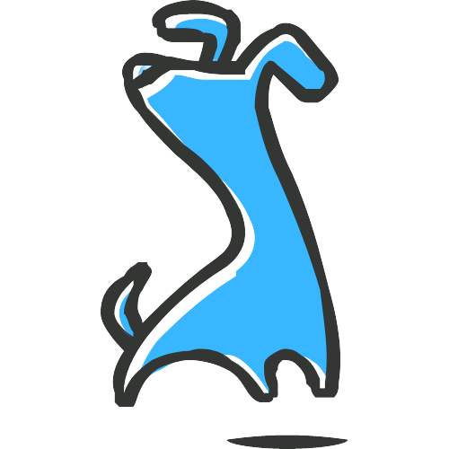

<h1>
Amigocão 
</h1>

Site de empresa fictícia que presta serviços de adestramento de cães.

É um projeto para treinar minhas habilidades em HTML, CSS e JavaScript

 
#

<h4> Disponível em </h4>
https://matheustrojan.github.io/dog-trainer/

#

<h4>
🚀 Features
</h4>

🟢 Mobile First  
🟢 Uma página para cada seção do site  
🟢 Captura as informações do formulário de contato e mostra no console  
🟢 Responsividade com todos tipos de tela  
🟢 Estilização final dos componentes do site  

  

