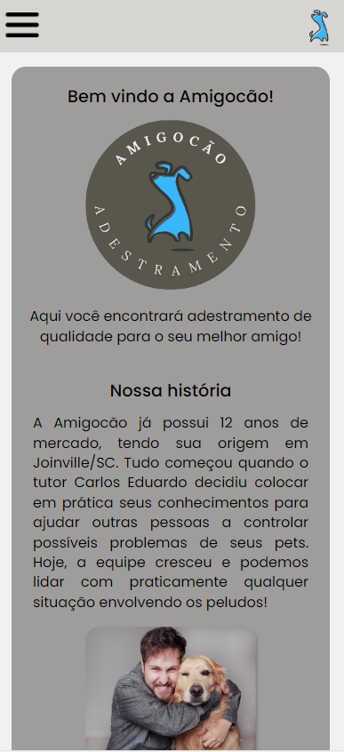

<h1>
Amigocão 
</h1>

Site de empresa fictícia que presta serviços de adestramento de cães.

É um projeto para treinar minhas habilidades em HTML, CSS e JavaScript

 
#

<h4> 
	🚧  Site em desenvolvimento...  🚧
</h4>

# 

<h4> Disponível em </h4>
https://matheustrojan.github.io/dog-trainer/

 (apenas mobile por enquanto, em outras telas pode quebrar o design) 

#

<h4>
🚀 Features
</h4>

🟢 Mobile First  
🟢 Uma página para cada seção do site  
🟡 Envio das informações do formulário com JS  
🟡 Responsividade com todos tipos de tela  
🟡 Estilização final dos componentes do site  

  

